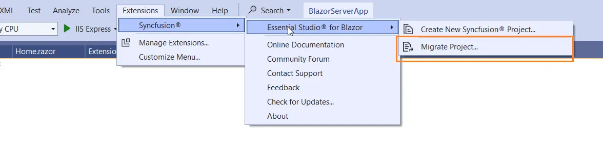
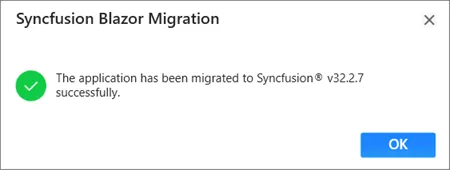

# Migrate a Project to the latest Syncfusion® Version

The Syncfusion&reg; Blazor Migration add-in for Visual Studio helps you update an existing Syncfusion&reg; Blazor project to a newer Essential Studio&reg; release. The tool updates NuGet package references and theme links and provides an optional backup to preserve your project before applying changes.

## Prerequisites

- Visual Studio 2022 or 2026 with the Syncfusion® Blazor Template Studio extension installed.
- An existing Syncfusion&reg; Blazor project that references the Syncfusion&reg; Blazor NuGet packages.
- .NET 8.0, .NET 9.0, or .NET 10.0 SDK.
- An active internet connection to load the available Syncfusion® Blazor versions from NuGet.org.

## Supported application types

- Blazor Web App (Server or WebAssembly rendering)
- Blazor Server App
- Blazor WebAssembly App (standalone or ASP.NET Core hosted)
- Blazor WebAssembly App (Progressive Web Application)

## Migration steps

1. Open the existing Syncfusion&reg; Blazor application in **Visual Studio 2022** or **Visual Studio 2026**.

2. Open the Migration Wizard using one of the following options:

    - Choose **Extensions → Syncfusion® → Essential Studio® for Blazor → Migrate Project…** from the Visual Studio menu.

        

    - Right-click the project in Solution Explorer, select **Syncfusion® Blazor**, then choose **Migrate Syncfusion® Blazor project from another version...**

      

    N> The Migration option appears only after the project references the Syncfusion&reg; Blazor NuGet packages. To add a package reference, see [Install NuGet packages](https://learn.microsoft.com/en-us/nuget/consume-packages/install-use-packages-visual-studio).

3. In the Syncfusion® Project Migration window, select the desired Syncfusion® Blazor version to migrate to. You can migrate to any newer version, including across major versions, in a single step. For very large version jumps, review the [Syncfusion® release notes](https://www.syncfusion.com/products/whatsnew) for breaking changes.

    

    N> Versions are loaded from the Syncfusion® Blazor NuGet packages available on [NuGet.org](https://www.nuget.org/) and require an active internet connection.

4. (Optional) Select **Enable a backup before migrating** and use the **Browse** button to choose a backup location. A copy of the original project is saved to the selected path.

5. Click **Migrate** to apply the changes.

6. After migration completes, a confirmation message is displayed.

    

    If a backup was created, the original project is saved to the specified backup path.

    

7. The migration updates the following in your project:

    - The `Syncfusion.Blazor` NuGet package reference in the `.csproj` file.
    - The `Syncfusion.Blazor.Themes` package reference.
    - The theme stylesheet link in `wwwroot/index.html` (WebAssembly) or `Pages/_Host.cshtml` / `App.razor` (Server / Web App).
    - Component namespaces in `_Imports.razor`.

8. Close and reopen Visual Studio, then rebuild the project to verify the changes. Check the project's build output for any breaking-change warnings that require manual updates.

9. If using the trial setup or NuGet packages from `nuGet.org`, register the Syncfusion® license key in the application. Syncfusion® introduced license registration in the 2018 Volume 2 (v16.2.0.41) Essential Studio® release. See the [licensing overview and key generation guide](https://help.syncfusion.com/common/essential-studio/licensing/overview#how-to-generate-syncfusion-license-key) to generate and register the Syncfusion® license key. For details about the licensing changes introduced in Essential Studio®, see the [2018 Volume 2 announcement](https://www.syncfusion.com/blogs/post/whats-new-in-2018-volume-2).
