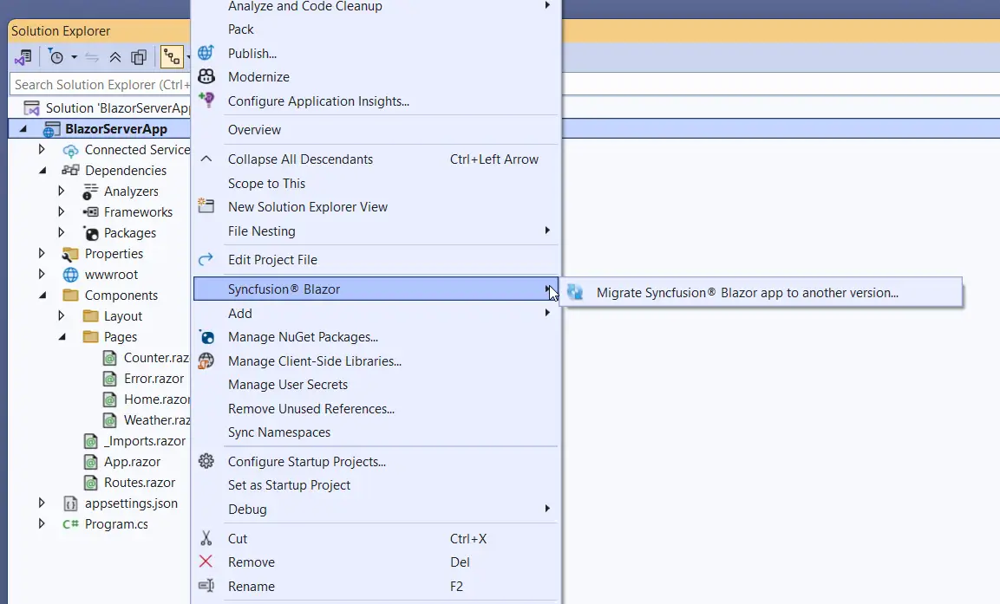
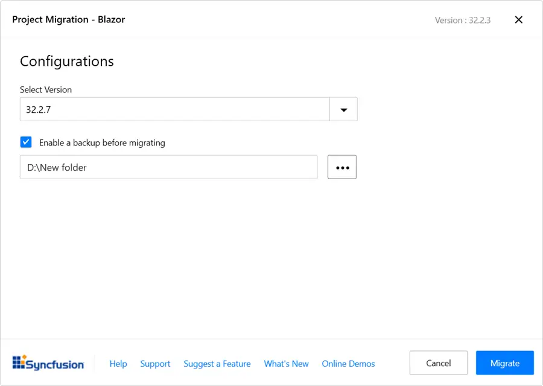

# Upgrade a Project to the latest Syncfusion® Version

The Syncfusion&reg; Blazor migration add-in for Visual Studio updates an existing Syncfusion&reg; Blazor application to a newer Essential Studio&reg; release by automatically updating NuGet package references and theme links.

## Steps to migrate the project

1. Open the existing Syncfusion&reg; Blazor application in **Visual Studio 2022** or **Visual Studio 2026**.

    Supported application types:
    - Blazor Web App (Server or WebAssembly rendering)
    - Blazor Server App
    - Blazor WebAssembly App (standalone or ASP.NET Core hosted)
    - Blazor WebAssembly App (Progressive Web Application)

2. Open the Migration Wizard using one of the following options:

    **Option 1:**

    Choose **Extensions -> Syncfusion® -> Essential Studio® for Blazor -> Migrate Project…** from the Visual Studio menu.

    

    **Option 2:**

    In **Solution Explorer**, right-click the project, select **Syncfusion® Blazor**, then choose **Migrate Syncfusion® Blazor project from another version...**

      

    N> The Migration option becomes available only after the project references the Syncfusion&reg; Blazor NuGet packages.

3. In the Syncfusion® Project Migration window, select the desired Syncfusion® Blazor version to migrate to.

    

    N> Versions are loaded from the Syncfusion® Blazor NuGet packages available on [NuGet.org](https://www.nuget.org/) and require an active internet connection.

4. (Optional) Select **Enable a backup before migrating** to create a backup of the original project and choose a backup location.

5. After migration completes, a confirmation message is displayed.

    

    If a backup was created, the original project will be saved to the specified backup path.

    

6. The migration updates the Syncfusion® Blazor NuGet package references in the application's `.csproj` to the selected version.

7. If using trial setup or NuGet packages from `nuGet.org`, register the Syncfusion® license key in the application. Syncfusion® introduced license registration in the 2018 Volume 2 (v16.2.0.41) Essential Studio® release. See the [licensing overview and key generation guide](https://help.syncfusion.com/common/essential-studio/licensing/overview#how-to-generate-syncfusion-license-key) to generate and register Syncfusion® license key. For details about the licensing changes introduced in Essential Studio®, see the [2018 Volume 2 announcement](https://www.syncfusion.com/blogs/post/whats-new-in-2018-volume-2).