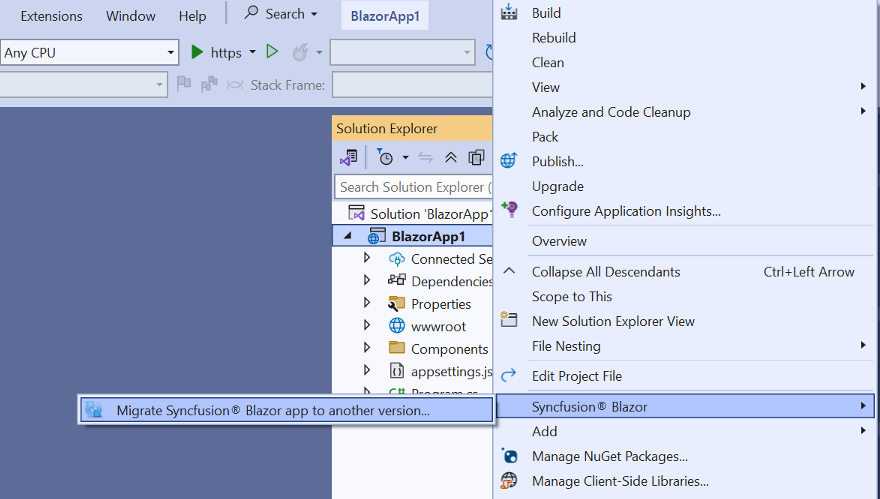

# Upgrading Syncfusion® Blazor application to latest version

The Syncfusion® Blazor project migration wizard for Visual Studio updates an existing Syncfusion® Blazor application from one Essential Studio® version to another by upgrading the corresponding Syncfusion® Blazor NuGet packages. This reduces manual effort and helps keep projects current.

The steps below describe how to upgrade the Syncfusion® version in a Syncfusion® Blazor application using Visual Studio 2022.

N> Before using the Syncfusion® Blazor Project Migration, verify that the Syncfusion® Blazor Template Studio extension is installed in Visual Studio (Extensions -> Manage Extensions -> Installed). If the extension is not installed, install it by following the instructions in the [download and installation](download-and-installation) help topic.

1. Open the Syncfusion® Blazor application that uses Syncfusion® components in Visual Studio 2022.

2. Open the Migration Wizard using one of the following options:

    **Option 1**

    Choose **Extensions -> Syncfusion® -> Essential Studio® for Blazor -> Migrate Project…** from the Visual Studio 2022 menu.

    

    **Option 2**

    In **Solution Explorer**, right-click the project, select **Syncfusion® Blazor**, and then choose **Migrate Syncfusion® Blazor project from another version...**

    

3. In the Syncfusion® Project Migration window, select the required Syncfusion® Blazor version to migrate to.

    N> Versions are loaded from the Syncfusion® Blazor NuGet packages published on [NuGet.org](https://www.nuget.org/packages?q=Tags%3A%22blazor%22syncfusion) and require an active internet connection.

    

4. Select the **Enable a backup before migrating** checkbox to create a project backup, and then choose the backup location.

5. After the migration completes, a confirmation message is displayed.

    

    If a backup was enabled, the original project is saved to the specified backup path after migration, as shown below.

    

6. The Syncfusion® Blazor NuGet packages are updated to the selected version in the Syncfusion® Blazor application.

7. If using a trial setup or packages from NuGet.org, a Syncfusion® license key must be registered with the application. Syncfusion® introduced license registration starting with the 2018 Volume 2 (v16.2.0.41) Essential Studio® release. Refer to the [licensing overview and key generation guide](https://help.syncfusion.com/common/essential-studio/licensing/overview#how-to-generate-syncfusion-license-key) to generate and register the Syncfusion® license key. For details about the licensing changes introduced in Essential Studio®, see the [2018 Volume 2 announcement](https://www.syncfusion.com/blogs/post/whats-new-in-2018-volume-2.aspx).