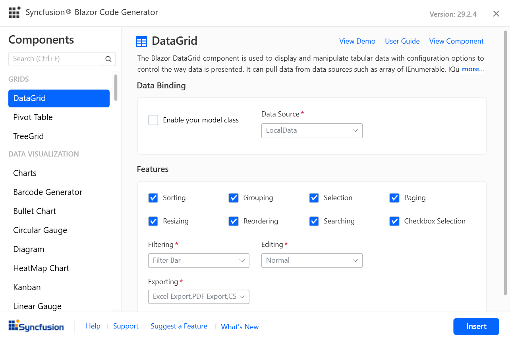

# Add Syncfusion Blazor component code

Syncfusion provides the Code Generator for the Blazor platform to add a code in the application quickly at the required place in the razor file. The Syncfusion extension adds the required Syncfusion component to render the code with namespaces, styles, and NuGet references. The Code Generator provides an easy-to-use wizard that interacts with data models and adds Syncfusion components with the required features to the application.

The following steps will help to add the Syncfusion components code in the Blazor application through **Visual Studio 2019**:

> Before using the Syncfusion Blazor Code Generator, check whether the Syncfusion Blazor Extension is installed or not in Visual Studio Extension Manager by clicking on the Extensions -> Manage Extensions -> Installed. If it is not installed, please install the [Syncfusion Blazor Extension](https://blazor.syncfusion.com/documentation/visual-studio-integration/visual-studio-extensions/download-and-installation/).

1. Open the existing Blazor application.

2. To open the Syncfusion Blazor Code Generator Wizard, select one of the following options in the Razor file, and add Syncfusion components:

   **Option 1:**

   To generate a specific component code, right-click the editor of the Razor file at the required line and select the **Syncfusion Blazor Code Generator...**

   

   **Option 2:**

   Choose **Extension -> Syncfusion -> Essential Studio for Blazor -> Syncfusion Blazor Code Generator...** from the **Visual Studio 2019 menu**.

   

3. The Syncfusion Blazor Code Generator wizard will appear. Select the required control.

    

    **Data Binding:** Data operation fields will be visible if the selected component has data. The data will be listed from the application. It interacts with data models and reduces the amount of time spent developing the project. The required Data Model Class, Data Source, Id, and more can be chosen from the application.

    **Feature:** Selected component features are listed. You can select the required features.

    **Control requirements:** Contains the required user input fields for the selected component. The required value can be provided for those fields to add the component code.

    Click **Insert**. This wizard generates the selected component render code and inserts it wherever the cursor is positioned.

    

4. In the Output window, click the **Syncfusion Blazor Code Generator** in "Show output from" drop-down to display the changes made to the application.

   

## Syncfusion integration

The project will configure the required NuGet packages, style, namespaces, and services when the Syncfusion component is being added.

### NuGet Packages

The corresponding component NuGet packages will be added as NuGet references.

> The installed Syncfusion extension version of a NuGet package will be added as a reference entry if there is no internet connection. The NuGet packages have to be restored when the internet connection is restored.

### Style

The Default (Bootstrap4) theme will be added from Syncfusion NuGet to these applications' locations if it is not already added.

| Application type  | File location  |
|---|---|
| Syncfusion Blazor Server App | {Project location}\Pages\\_Host.cshtml |
| Syncfusion Blazor WebAssembly App (ASPNET Core hosted)   Syncfusion Blazor WebAssembly App (ASPNET Core hosted and Progressive Web Application) | {Client Project location}\wwwroot\index.html  |
| Syncfusion Blazor WebAssembly App   Syncfusion Blazor WebAssembly App (Progressive Web Application) | {Project location}\wwwroot\index.html|

### Namespaces

The required namespaces are added to the **`_imports.razor`** file based on the selected component, if it is not already available.

### Services

The required service code is added to the **`Startup.cs/Program.cs`** file to render the component based on the selected component if it is not already added.

If the trial setup or NuGet packages are installed from nuget.org, register the Syncfusion license key to the project as Syncfusion has introduced the licensing system from 2018 Volume 2 (v16.2.0.41) Essential Studio release. Navigate to the [help topic](https://help.syncfusion.com/common/essential-studio/licensing/license-key#how-to-generate-syncfusion-license-key) to generate and register the Syncfusion license key to the project. Refer to this [blog](https://blog.syncfusion.com/post/Whats-New-in-2018-Volume-2-Licensing-Changes-in-the-1620x-Version-of-Essential-Studio.aspx?_ga=2.11237684.1233358434.1587355730-230058891.1567654773) post to know more about the licensing changes introduced in Essential Studio.