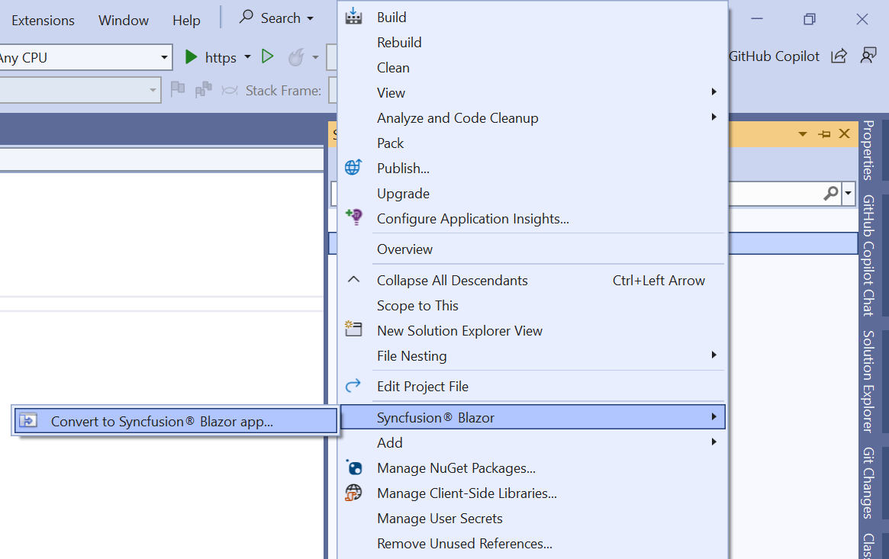

# Converting Blazor application to Syncfusion Blazor application

Syncfusion Blazor conversion is a Visual Studio add-in that converts an existing Blazor application to the Syncfusion Blazor application by adding the required assemblies and theme files.

The following steps helps to convert the **Blazor application** to the **Syncfusion Blazor application** via the **Visual Studio 2019**:

> Before using the Syncfusion Blazor Project Conversion, check whether the Syncfusion Blazor Template Studio Extension is installed or not in Visual Studio Extension Manager by clicking on the Extensions -> Manage Extensions -> Installed.

1. Open the existing Blazor application or create a new Blazor application.

2. To open the Syncfusion Project Conversion Wizard, follow either one of the options below:

    **Option 1:**

    Choose **Extensions -> Syncfusion -> Essential Studio for Blazor -> Convert Project...** in the Visual Studio 2019 menu.

    

    **Option 2:**

    Right-click the application from the **Solution Explorer** and select the **Syncfusion Blazor** and choose the **Convert to Syncfusion Blazor application...**

    

3. The Syncfusion Blazor Project Conversion window will appear. The required version of Syncfusion Blazor and Themes can be chosen to convert the application.

    

    > The versions are loaded from the Syncfusion Blazor NuGet packages published in [NuGet.org](https://www.nuget.org/packages?q=Tags%3A%22blazor%22syncfusion) and it requires internet connectivity.

4. Check the **“Enable a backup before converting”** checkbox to take the project backup and choose the location.

5. Once the conversion process has been completed, a successful message window will be displayed.

    

    If the project backup is enabled before converting, the old project will be saved in the specified backup path location as shown below once the conversion process is completed.

    

6. If the trial setup or NuGet packages are installed from nuget.org, register the Syncfusion license key to the corresponding project since Syncfusion introduced the licensing system from 2018 Volume 2 (v16.2.0.41) Essential Studio release. Navigate to the [help topic](https://help.syncfusion.com/common/essential-studio/licensing/license-key#how-to-generate-syncfusion-license-key) to generate and register the Syncfusion license key to the project. Refer to this [blog](https://blog.syncfusion.com/post/Whats-New-in-2018-Volume-2-Licensing-Changes-in-the-1620x-Version-of-Essential-Studio.aspx?_ga=2.11237684.1233358434.1587355730-230058891.1567654773) post for understanding the licensing changes introduced in Essential Studio.

## NuGet Packages

Based on the application type, the following NuGet packages are added as NuGet references.

| Syncfusion Blazor NuGet packages  | Application type  |
|---|---|
| `Syncfusion.Blazor`  | Syncfusion Blazor Server App   Syncfusion Blazor WebAssembly App   Syncfusion Blazor WebAssembly App (ASPNET Core hosted)   Syncfusion Blazor WebAssembly App (Progressive Web Application)   Syncfusion Blazor WebAssembly App (ASPNET Core hosted and Progressive Web Application)|
| `Syncfusion.Blazor.PdfViewerServer.Windows`  | Syncfusion Blazor Server App  |
| `Syncfusion.Blazor.WordProcessor`  | Syncfusion Blazor Server App   Syncfusion Blazor WebAssembly App   Syncfusion Blazor WebAssembly App (ASPNET Core hosted)   Syncfusion Blazor WebAssembly App (Progressive Web Application)   Syncfusion Blazor WebAssembly App (ASPNET Core hosted and Progressive Web Application)|

## Theme link

While converting the project, the Syncfusion Blazor theme is added in the following location of a Blazor application.

| Application type  | File location  |
|---|---|
| Syncfusion Blazor Server App | {Project location}\Pages\\_Host.cshtml |
| Syncfusion Blazor WebAssembly App (ASPNET Core hosted)   Syncfusion Blazor WebAssembly App (ASPNET Core hosted and Progressive Web Application) | {Client Project location}\wwwroot\index.html  |
| Syncfusion Blazor WebAssembly App   Syncfusion Blazor WebAssembly App (Progressive Web Application) | {Project location}\wwwroot\index.html|

