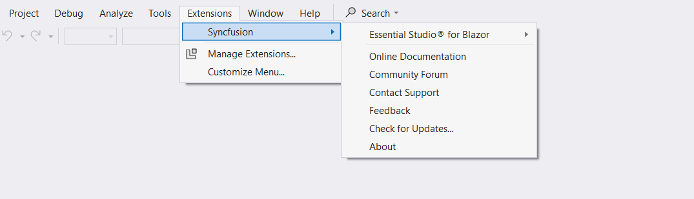

# Download and Installation

Syncfusion publishes the Visual Studio extension in the [Visual Studio marketplace](https://marketplace.visualstudio.com/items?itemName=SyncfusionInc.Blazor-Extension). You can either install it directly from Visual Studio or download and install it from the Visual Studio marketplace.

## Prerequisites

The following software prerequisites must be installed to install the Syncfusion Blazor extension, as well as to creating, adding snippet, converting, and upgrading Syncfusion Blazor applications.

* [Visual Studio 2019 16.3 or later](https://visualstudio.microsoft.com/downloads).

* [.NET Core 3.0 or later](https://dotnet.microsoft.com/download/dotnet-core).

## Install through the Visual Studio Manage Extensions

The steps below assist you to how to install the Syncfusion Blazor extensions from **Visual Studio Manage Extensions**.

1. Open the Visual Studio 2019.

2. Navigate to **Extension ->Manage Extensions** and open the Manage Extensions.

3. On the left, click the **Online** tab and type **"Syncfusion Blazor"** in the **search box**.

    

4. Click the **Download** button in the **“Syncfusion Blazor Template Studio”** extensions.

5. Close all Visual Studio instances after downloading the extensions to begin the installation process. You will see the following VSIX installation prompt.

    

6. Click the **Modify** button.

7. After the installation is complete, open Visual Studio 2019.

8. Now, under the menu **Extensions**, you can use the Syncfusion extensions from the Visual Studio.

    

## Install from the Visual Studio Marketplace

The steps below illustrate how to download and install the Syncfusion Blazor extension from the Visual Studio Marketplace.

1. Download the [Syncfusion Blazor Extensions](https://marketplace.visualstudio.com/items?itemName=SyncfusionInc.Blazor-Extension) from the Visual Studio Marketplace.

2. Close all Visual Studio instances running, if any.

3. Double-click to install the downloaded VSIX file. You will see the VSIX installation prompts for the Visual Studio 2019 version. If Visual Studio 2019 is not installed, it will not be possible to install the extension.

    

4. Click the **Modify** button.

5. After the installation is complete, open Visual Studio 2019. You can now use Syncfusion extensions from the Visual Studio under the **Extensions** menu.

     