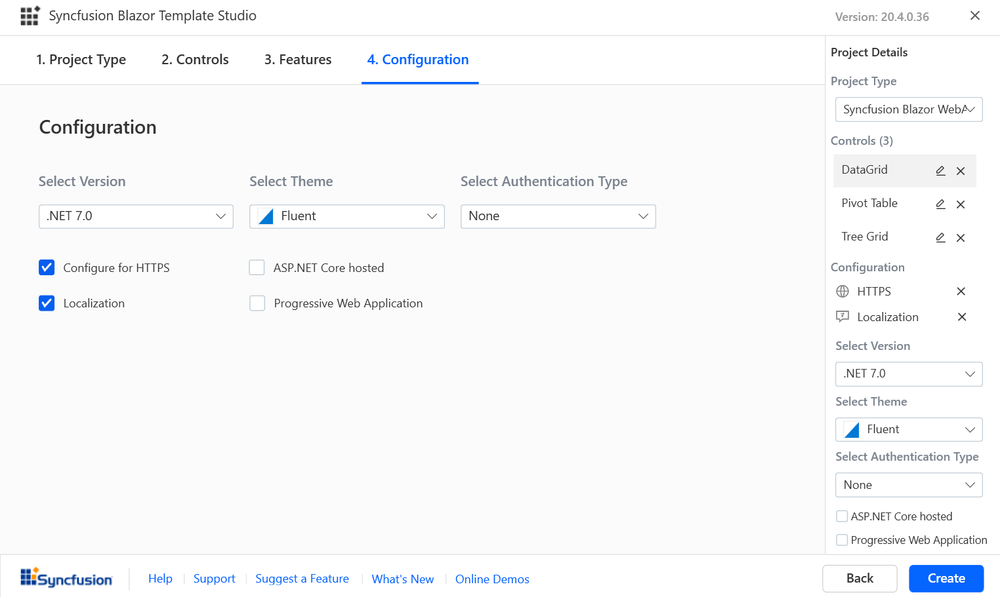

# Syncfusion Blazor Template Studio

Syncfusion provides the Blazor Template Studio, which allows you to create a Syncfusion Blazor application with Syncfusion components. The Syncfusion Blazor app is created with the required component Syncfusion NuGet references, namespaces, styles, and component render code. The Template Studio provides an easy-to-use project wizard that walks you through the process of creating an application with Syncfusion components.

The steps below will assist you to create your **Syncfusion Blazor Application** through **Visual Studio 2019**:

> Before use the Syncfusion Blazor Project Template, check whether the Syncfusion Blazor Template Studio Extension installed or not in Visual Studio Extension Manager by clicking on the Extensions -> Manage Extensions -> Installed. If this extension not installed, please install the extension by follow the steps from the [download and installation](https://blazor.syncfusion.com/documentation/visual-studio-integration/visual-studio-extensions/download-and-installation/) help topic.

1. Open Visual Studio 2019.

2. To create a Syncfusion Blazor application, use either one of the following options:

     **Option 1**

     Choose **Extension -> Syncfusion -> Essential Studio for Blazor -> Create New Syncfusion Project...** from the **Visual Studio menu**.

     

     **Option 2**

     Choose **File -> New -> Project** from the menu. This launches a new dialogue for creating a new application. Syncfusion templates for Blazor can be found by filtering the application type for **Syncfusion** or by entering **Syncfusion** as a keyword in the search option.

     

3. Select the **Syncfusion Blazor Template Studio** and click **Next**.

     

4. The Template Studio wizard for configuring the Syncfusion Blazor app will be launched. Choose the Syncfusion Blazor application type.

     

     > .NET 6.0 is available from v19.4.0.38 and support from Visual Studio 2022.

     **Project type section**

     Choose one of the Syncfusion Blazor application types:
     * Syncfusion Blazor Server App
     * Syncfusion Blazor WebAssembly App

     In the Syncfusion Blazor WebAssembly App application type, we can choose **ASP.NET Core hosted**, **Progressive Web Application**, or both.

     

     > **Note:** The Progressive Web Application will be enabled if .NET Core version 3.1.200 or higher is installed.

5. Click either **Next** or the **Controls** tab. The Syncfusion Blazor components you can add to the application are listed.

     

     Choose the required control(s) by clicking **Add**.

     To unselect the added control(s), use either one of the following options:

     **Option 1:** Click **Remove** in the corresponding control box.

     **Option 2:** Click Delete in the control list from **Project Details**.

     > **Note:** Choose at least one control to enable the Features and Configuration tab.

6. Click either **Next** or the **Features** tab, and you will see the features listed for the selected controls. You can choose the required features.

7. Click either **Next** or the **Configuration** tab, and the Configuration section will be loaded. You can choose the required (.NET 6.0, .NET 5.0 and ASP NET Core 3.1), themes, https configuration, authentication type (None, Individual Accounts, Microsoft Identity Platform, and Windows), and Blazor Web Assembly application types (ASP.NET Core hosted and Progressive Web Application).

     > **Note:** ASP.NET Core hosted and Progressive Web Application options are only visible for the Blazor Web Assembly App application type.

     

     **Project details section**

     You can change the configuration details below in the Project Details section to change the application type, remove control(s) from the selected controls, or change the configurations.

8. Click **Create** button. The Syncfusion Blazor application has been created. The created Syncfusion Blazor app has the Syncfusion NuGet packages, styles, and the render code for the Syncfusion component.

     

9. If you installed the trial setup or NuGet packages from nuget.org you must register the Syncfusion license key to your application since Syncfusion introduced the licensing system from 2018 Volume 2 (v16.2.0.41) Essential Studio release. Navigate to the [help topic](https://help.syncfusion.com/common/essential-studio/licensing/license-key#how-to-generate-syncfusion-license-key) to generate and register the Syncfusion license key to your application. Refer to this [blog](https://blog.syncfusion.com/post/Whats-New-in-2018-Volume-2-Licensing-Changes-in-the-1620x-Version-of-Essential-Studio.aspx?_ga=2.11237684.1233358434.1587355730-230058891.1567654773) post for understanding the licensing changes introduced in Essential Studio.

## Syncfusion integration

The Syncfusion Blazor application configures with most recent Syncfusion Blazor NuGet packages version, styles, namespaces, and component render code for Syncfusion components.

### NuGet Packages

Based on the selected Syncfusion Blazor controls, the individual NuGet packages can be added as NuGet references. Refer [this topic](https://blazor.syncfusion.com/staging/documentation/nuget-packages/) to know about the individual Blazor NuGet packages.

> The latest Syncfusion Essential Studio version of a NuGet package will be added as reference entry from nuget.org if there is no internet connection. You should restore the NuGet packages when internet becomes available.

### Style

The selected Syncfusion Blazor theme is added from Syncfusion NuGet and this theme reference will be added at these applications locations in Blazor.

| Application type  | File location  |
|---|---|
| Syncfusion Blazor Server App | {Project location}\Pages\\_Host.cshtml |
| Syncfusion Blazor WebAssembly App (ASPNET Core hosted)   Syncfusion Blazor WebAssembly App (ASPNET Core hosted and Progressive Web Application) | {Client Project location}\wwwroot\index.html  |
| Syncfusion Blazor WebAssembly App   Syncfusion Blazor WebAssembly App (Progressive Web Application) | {Project location}\wwwroot\index.html|

### Namespaces

The Syncfusion.Blazor namespaces are added in the **`_imports.razor`** file.

### Component render code

The selected Syncfusion Blazor components and features render code added as .razor files in the pages folder.

### Authentication Configuration

We need to register the created application in Google Platform API Console for Individual Accounts and Azure Active Directory for Microsoft Identity Platform. From Google Platform API Console registration we can get the client id for Individual Accounts. From Azure Active Directory registrations we can get the tenant id and application client id for Microsoft Identity Platform. We need to configure these id values in created applications then only application will be run correctly with authentication support.

### Individual Accounts Authentication

#### Web Application and Progressive Web Application

1. Go to below credentials page for the Google cloud platform API console.

    <https://console.cloud.google.com/apis/credentials?project=aerobic-furnace-244104>

2. Click Create Credentials and OAuth Client Id.

    

    

3. Select Application type as Web Application in client Id creation.

    

4. Add your publish URL link as an Authorized URI and login URL as Redirected URI.

    

5. Click save then OAuth client id will be created and copy that credentials.

    

6. Add that Client Id, and RedirectUri in appsettings.json file of your application.

    

7. Change the build configuration bind as google from Local in program.cs file.

    

### Microsoft Identity Platform Authentication

#### Server Application

1. Go to below Azure Active Directory App Registration page.

    <https://portal.azure.com/#blade/Microsoft_AAD_IAM/ActiveDirectoryMenuBlade/RegisteredApps>

2. Click New Registration in App Registration page.

    

3. Give name of the application and selected supported type as single tenant.

    

4. Dropdown the page, select platform as web and give your application Redirect URI and click Register.

    

5. App will be registered, go to the Authentication page and tick Id token check box.

    

6. Get client tenant id and application id form overview page.

    

7. Configure those client tenant id, application id, and domain in your application appsettings.json file.

    

#### Web Application and Progressive Web Application

1. Go to below Azure Active Directory App Registration page.

    <https://portal.azure.com/#blade/Microsoft_AAD_IAM/ActiveDirectoryMenuBlade/RegisteredApps>

2. Click New Registration in App Registration page.

    

3. Give name of the application and selected supported type as single tenant.

    

4. Dropdown the page, select platform as web and give your application Redirect URI and click Register.

    

5. App will be registered, go to the Authentication page and tick Access token an Id token check box.

    

6. Migrate the API by clicking the highlighted arrow like in below image.

    

    

7. Get client tenant id and application id form overview page.

    

8. Configure those client tenant id and application id in your application appsettings.json file.

    

#### ASP.NET Core Hosted Web Application, and ASP.NET Core Hosted with Progressive Web Application

##### Client project Registration and Configuration

1. Go to below Azure Active Directory App Registration page.

    <https://portal.azure.com/#blade/Microsoft_AAD_IAM/ActiveDirectoryMenuBlade/RegisteredApps>

2. Click New Registration in App Registration page.

    

3. Give name of the application and selected supported type as single tenant.

    

4. Dropdown the page, select platform as web and give your application Redirect URI and click Register.

    

5. App will be registered, go to the Authentication page and tick Access token an Id token check box.

    

6. Migrate the API by clicking the highlighted arrow like in below image.

    

    

7. Get client tenant id and application id form overview page.

    

8. Configure those client tenant id and application id in your application appsettings.json file.

    

##### Server project Registration and configuration

1. Go to below Azure Active Directory App Registration page.

    <https://portal.azure.com/#blade/Microsoft_AAD_IAM/ActiveDirectoryMenuBlade/RegisteredApps>

2. Click New Registration in App Registration page.

    

3. Give name of the application and selected supported type as single tenant.

    

4. Dropdown the page, select platform as web and give your application Redirect URI and click Register.

    

5. App will be registered, go to the Authentication page and tick Access token an Id token check box.

    

6. Migrate the API by clicking the highlighted arrow like in below image.

    

    

7. Add a scope API in Expose an API page.

    

8. Give scope name, admin consent display name, and admin consent description and click Add scope. Scope API will be created, copy those scope API Value.

    

9. Get client tenant id and application id form overview page.

    

10. Configure those client tenant id, application id, and domain in your application appsettings.json file.

    

11. Configure the scope API in client application program.cs file below highlighted place.

    

### Run application

You can run the application and see the Syncfusion components you selected. Select a component to see component output.

You can select a culture language in combobox at top right on the output page to apply the culture in the application.

> **Note:** Above culture combobox will be enabled in sample output if localization option is selected in configuration window from Syncfusion Blazor Template Studio wizard.

### Register and Login Application

### Individual Authentication

#### Server Application, ASP.NET Core hosted Web Application, and Progressive Web Application with ASP.NET Core hosted

1. For register the application, submit your email address and create a password.

    

2. Confirming registration by clicking **Click here to confirm your account.**

    

3. Submit your registered email address and password to login the application.

    

#### Web Application and Progressive Web Application

1. Login to the application using Gmail accounts.

    

### Microsoft Identity Platform

#### Server Application, Web Application, Progressive Application, ASP.NET Core Hosted Web Application, and ASP.NET Core Hosted with Progressive Web Application

1. Login to your application using your Microsoft account.

2. Accept permission request of your application.

    
